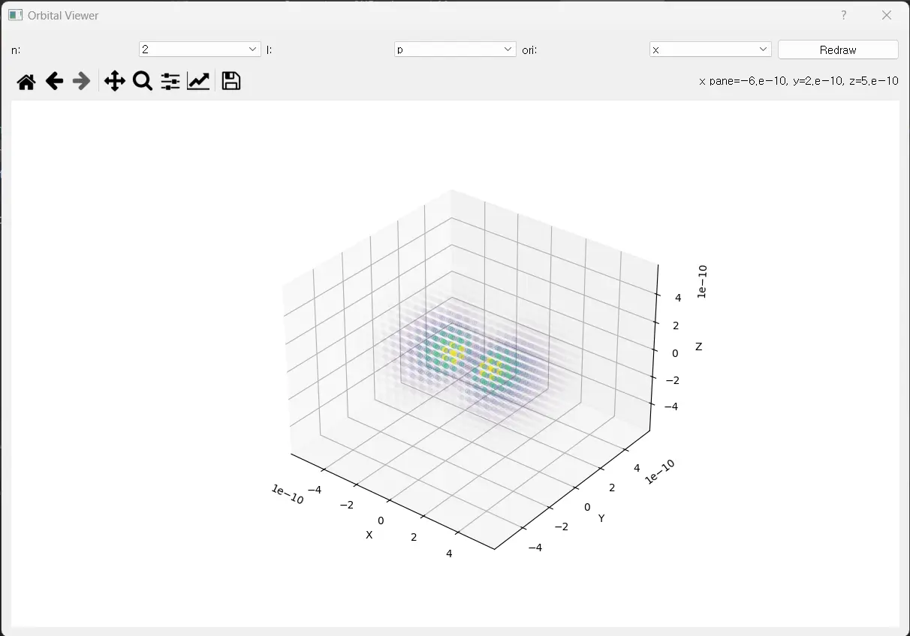

# Hydrogen Orbital Visualizer

수소 원자의 파동 함수를 이용하여 전자 구름의 형태를 시각화하는 프로그램입니다.

## 이론적 배경

### 파동함수

$\hat H \psi = E \psi$

파동함수는 슈뢰딩거 방정식을 풀어서 구한 함수입니다. 잘 갖추어진 파동함수는 아래와 같은 4가지 조건을 가집니다.

1. 무한대의 구간에서 유한한 값을 가지고
2. 단일값을 가지며
3. 연속이고
4. 1차 도함수도 연속이다

이때, 아래의 조건을 만족하는 $N$을 곱한 파동함수 $\psi$를 정규화된 파동함수라고 부릅니다.

$N^{2} \int^{\infty }_{- \infty} \psi \times \psi = 1$

막스 보른은 이러한 정규화된 파동함수의 제곱이 전자를 발견할 확률이라고 해석했습니다.

### 양자수

양자수는 오비탈의 특징을 결정하는 값들입니다. 4가지 양자수가 존재합니다.

1. 주양자수 $n$

주 양자수는 전자의 에너지를 결정합니다. 주 양자수가 커질수록 전자의 에너지는 커집니다. (ex. 1, 2, 3)

2. 부양자수 $l$

부 양자수는 전자의 각운동량을 결정합니다. 다시 말해 오비탈의 모양을 결정합니다. (ex. 0, 1, 2, 3) 
이때 0은 s, 1은 p, 2는 d, 3은 f 오비탈을 의미합니다.

3. 자기양자수 $m_{l}$

자기 양자수는 Z축 성분의 각운동량을 결정합니다. (ex. -l, -l+1, ..., 0, ..., l-1, l)

4. 스핀양자수 $m_{s}$

제이만 효과에 의해 휘는 방향을 결정합니다. (ex. -1/2, 1/2)

### 결론

파동함수를 계산하는 것은 매우 어려운 작업입니다. 이 프로그램은 이미 ~~똑똑한~~ 수학자들이 구해둔 
파동함수를 이용하여 각 지점에서 전자의 존재 확률을 시각화하고 있습니다.

다양한 오비탈의 모양을 직접 눈으로 확인해보세요!